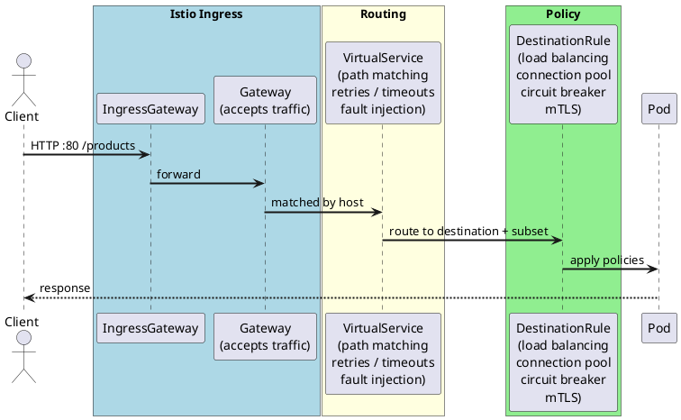

# Istio — Products App

## Prerequisites

- Minikube running with at least 2 CPUs and 4GB RAM
- Istio installed with minimal profile + ingress gateway
- `dev` namespace created and labeled for sidecar injection

## Setup

**1. Install Istio:**

```bash
istioctl install --set profile=minimal --set components.ingressGateways[0].enabled=true --set components.ingressGateways[0].name=istio-ingressgateway -y
```

**2. Create and label the namespace:**

```bash
kubectl create namespace dev
kubectl label namespace dev istio-injection=enabled
```

**3. Deploy the app (sidecar will be auto-injected):**

```bash
helm upgrade --install products-dev ./helm/products -f ./helm/products/values.yaml -f ./helm/products/values-dev.yaml -n dev
```

**4. Verify sidecar injection (expect 2/2):**

```bash
kubectl get pods -n dev
```

## Traffic Flow



## Gateway & VirtualService

Defined in `helm/products/templates/gateway.yaml`.

- `Gateway` — listens on port 80, accepts all hosts
- `VirtualService` — routes `/products` traffic to the products service

**Get the ingress URL:**

```bash
minikube service istio-ingressgateway -n istio-system --url
```

Minikube exposes 3 ports:

- Port 1 → HTTP (80)
- Port 2 → HTTPS (443)
- Port 3 → Status/health (15021)

**Test:**

```bash
curl http://127.0.0.1:<http-port>/products
```

## Useful commands

```bash
kubectl get gateway -n dev                  # list gateways
kubectl get virtualservice -n dev           # list virtual services
kubectl get pods -n istio-system            # istio control plane pods
istioctl proxy-status                       # sidecar sync status
istioctl analyze -n dev                     # detect config issues
```
