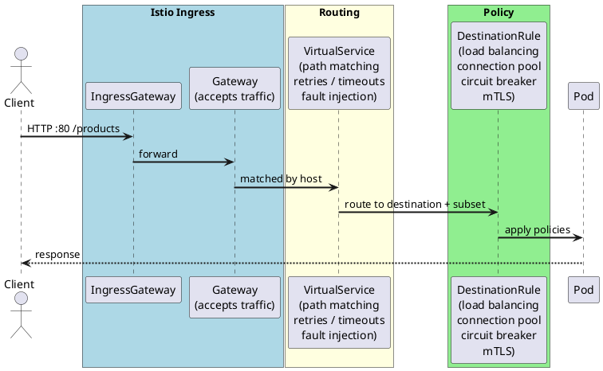

# Istio — Products App

## Setup

Run `make setup` first (installs Istio + creates/labels namespaces).

**1. Deploy the app (sidecar will be auto-injected):**

```bash
# From project root
helm upgrade --install products-dev ./helm/local/products -f ./helm/local/products/values.yaml -f ./helm/local/products/values-dev.yaml -n dev
```

**2. Verify sidecar injection (expect 2/2):**

```bash
kubectl get pods -n dev
```

## Traffic Flow



## Resource Hierarchy

Each Istio resource answers a different question:

| Resource          | Level               | Question                                                               |
|-------------------|---------------------|------------------------------------------------------------------------|
| `Gateway`         | Cluster entry point | What traffic do I accept? (port, protocol, host)                       |
| `VirtualService`  | Routing             | Where does it go? (path, headers, weights, retries)                    |
| `DestinationRule` | Workload            | How do I talk to what's there? (pods, load balancing, circuit breaker) |

```
Gateway          → cluster entry point (port, protocol, host)
VirtualService   → routing rules (path, headers, weights, retries)
DestinationRule  → workload policies (which pods, how to talk to them)
```

## Gateway & VirtualService

Defined in `helm/local/products/templates/gateway.yaml` (project root).

- `Gateway` — listens on port 80, accepts all hosts
- `VirtualService` — routes `/products` traffic to the products service

**Get the ingress URL (kind):**

```bash
kubectl get svc istio-ingressgateway -n istio-system
```

**Test:**

```bash
curl http://127.0.0.1:<http-port>/rbn/dev/products
```

## Useful commands

```bash
kubectl get gateway -n dev                  # list gateways
kubectl get virtualservice -n dev           # list virtual services
kubectl get pods -n istio-system            # istio control plane pods
istioctl proxy-status                       # sidecar sync status
istioctl analyze -n dev                     # detect config issues
```
