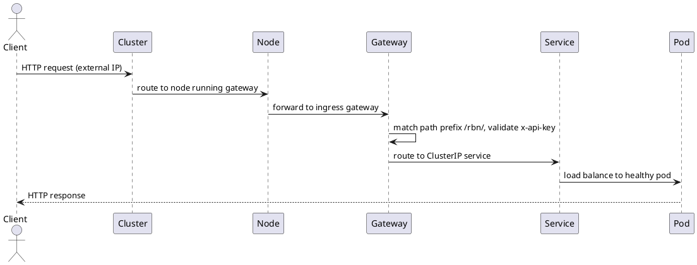
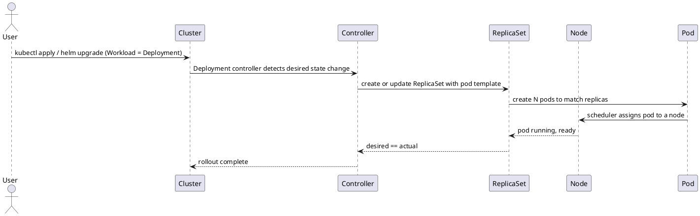

# Kubernetes Reference

## RBAC & IAM

### Concept Map

| Concept              | What it is                                            | Where it lives | Coverable in Minikube/Kind |
|----------------------|-------------------------------------------------------|----------------|----------------------------|
| `ServiceAccount`     | Identity for a pod/workload                           | Kubernetes     | ✅                          |
| `Role`               | Set of permissions scoped to a namespace              | Kubernetes     | ✅                          |
| `ClusterRole`        | Set of permissions scoped cluster-wide                | Kubernetes     | ✅                          |
| `RoleBinding`        | Attaches a `Role` to a `ServiceAccount`               | Kubernetes     | ✅                          |
| `ClusterRoleBinding` | Attaches a `ClusterRole` to a `ServiceAccount`        | Kubernetes     | ✅                          |
| `Secret`             | Stores sensitive data inside the cluster              | Kubernetes     | ✅                          |
| `kubectl auth can-i` | Verify what a service account can do                  | Kubernetes     | ✅                          |
| Namespace isolation  | Roles in `dev` don't apply in `prod`                  | Kubernetes     | ✅                          |
| GCP Service Account  | Identity for a GCP workload (not K8s)                 | GCP IAM        | ❌                          |
| GCP Roles            | Predefined (`roles/viewer`) or custom permission sets | GCP IAM        | ❌                          |
| IAM Policy Binding   | Attaches a GCP role to a GCP service account          | GCP IAM        | ❌                          |
| Least Privilege      | Granting only the permissions needed                  | Both           | ✅ concept / ❌ GCP-specific |
| Workload Identity    | Links K8s `ServiceAccount` → GCP `ServiceAccount`     | GCP + K8s      | ❌ (GKE only)               |
| IAM Conditions       | Conditional access based on resource/time/context     | GCP IAM        | ❌                          |
| Audit Logs           | Who did what, when                                    | GCP IAM        | ❌                          |
| Secret Manager       | Managed secrets service (replaces K8s `Secret`)       | GCP            | ❌                          |

### Key Distinctions

- **Kubernetes RBAC** controls access *inside* the cluster (who can read secrets, configmaps, pods, etc.)
- **GCP IAM** controls access *to GCP resources* (buckets, APIs, databases, etc.)
- **Workload Identity** is the bridge — links a K8s `ServiceAccount` to a GCP `ServiceAccount` so a pod can call GCP
  APIs without a key file. GKE only.

### Helm Chart Structure

```
helm/local/products/templates/
├── configmap.yaml             # injects env vars per environment
├── deployment.yaml            # references serviceAccountName to bind the pod identity
├── gateway.yaml               # Istio Gateway + VirtualService
├── service.yaml               # ClusterIP — internal only, Istio handles external traffic
└── rbac/
    ├── serviceaccount.yaml    # assigns a named identity to the products pod
    ├── role.yaml              # grants read access to its own ConfigMap only
    ├── rolebinding.yaml       # binds the role to the service account
    └── networkpolicy.yaml     # default-deny-all (zero trust baseline, requires Calico)
```

### Service Types & Network Access

| Type           | Internal | External | Notes                                                |
|----------------|----------|----------|------------------------------------------------------|
| `ClusterIP`    | ✅        | ❌        | Default. Use with Istio Gateway.                     |
| `NodePort`     | ✅        | ✅        | Via node IP + port (30000–32767)                     |
| `LoadBalancer` | ✅        | ✅        | Cloud-provisioned external IP. Costs credits on GCP. |

### Internal DNS

Every service is reachable inside the cluster at:

```
<service-name>.<namespace>.svc.cluster.local
# shorthand within the same namespace:
<service-name>
```

### Zero Trust with NetworkPolicy

Requires a CNI that enforces `NetworkPolicy` (e.g. Calico):

```bash
minikube start --cni=calico
```

Default deny-all baseline:

```yaml
apiVersion: networking.k8s.io/v1
kind: NetworkPolicy
metadata:
  name: default-deny-all
  namespace: dev
spec:
  podSelector: {}
  policyTypes:
    - Ingress
    - Egress
```

Then explicitly allow only what's needed (e.g. `users` → `products`):

```yaml
apiVersion: networking.k8s.io/v1
kind: NetworkPolicy
metadata:
  name: allow-users-to-products
  namespace: dev
spec:
  podSelector:
    matchLabels:
      app: products-dev
  policyTypes:
    - Ingress
  ingress:
    - from:
        - podSelector:
            matchLabels:
              app: users-dev
```

### Architecture Diagrams

#### Request Flow (runtime)



#### Workload Deployment (control plane)



## Docker Build

A multi-stage `Dockerfile` is used: Stage 1 compiles via GraalVM `nativeCompile`, Stage 2 runs the binary on `debian:bookworm-slim` (no JVM).

### Layer caching

Gradle wrapper and dependency descriptors are copied before source so Docker reuses the dependency resolution layer on subsequent builds when only source changes.

### Going even smaller (optional)

By default the native binary is dynamically linked against glibc. To use a `scratch` base image, add `--static --libc=musl` to the native compile args and switch to a musl-based build image.

### Useful Commands

```bash
# Verify what a service account can do
kubectl auth can-i get secrets --as=system:serviceaccount:dev:users-dev -n dev

# Exec into a pod to test internal DNS / network
kubectl exec -it <pod-name> -n dev -- sh
curl http://products-dev:8080/rbn/dev/products

# Check NetworkPolicy enforcement
kubectl get networkpolicy -n dev
```
